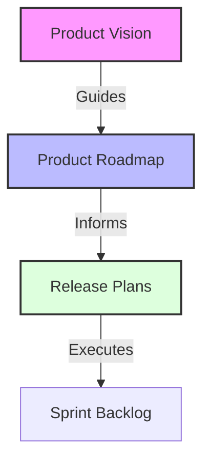
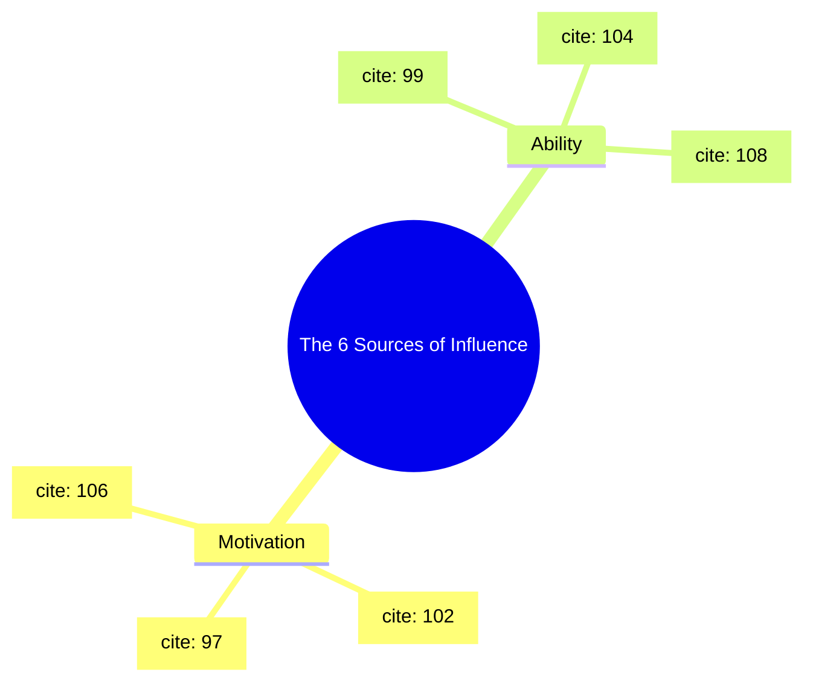
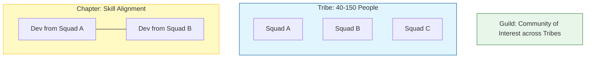

# Agile in the Organization: A Comprehensive Study Guide

## 1. Value-Driven Delivery

In Agile, the primary goal is not just completing tasks, but delivering value.

* [cite_start]**Definition of Value:** Value is defined as what provides benefits to users, which can include financial gains, user engagement, or compliance[cite: 1].
* [cite_start]**The Goal:** The Agile principle emphasizes satisfying customers by delivering valuable products quickly and efficiently[cite: 2].

### The "Build and Run" Framework
To deliver value, teams must focus on three specific areas:
1.  [cite_start]**Building the Right Thing:** Engaging in solution-oriented conversations with customers to understand their needs and goals[cite: 5].
2.  [cite_start]**Building the Thing Right:** Focusing on necessary features to avoid complexity and potential issues[cite: 6].
3.  [cite_start]**Running it Right:** Planning for ongoing support and user interactions after delivery to maintain value over time[cite: 7].

---

## 2. The Value Roadmap

[cite_start]A value roadmap is a strategic tool used to map out product ideas and delivery strategies[cite: 20].

### Key Components
| Component | Definition | Responsibility |
| :--- | :--- | :--- |
| **Product Vision** | Defines what the product is and who uses it. [cite_start]It acts as the guiding principle[cite: 21]. | The Team |
| **Product Roadmap** | [cite_start]A high-level overview of requirements and milestones to ensure the team builds the right product[cite: 22]. | Product Owner |
| **Release Plans** | Outlines expected release dates and feature goals. [cite_start]These are "living documents" flexible to adjustments[cite: 23]. | Product Owner & Project Manager |

### Hierarchy of Planning

Best Practices for Roadmaps:

Make it highly noticeable to the team and refer to it frequently.

Clearly indicate the highest priority items.

Review regularly with sponsors to ensure it remains the project blueprint.

## 3. Managing Change in Agile
One of the four Agile values is "Responding to change over following a plan".

The Triple Constraint
When identifying a needed change, Agile managers look at three specific constraints:

Scope (The What): The product roadmap, backlog items, or intended deliverables.

Time (The When): The release schedule, roadmap timeline, or sprint duration.

Cost/Resources (The How): The makeup of the team, equipment, or budget.

The Change Process
When a change is identified, follow these steps:

Identify the Decider: Usually the Product Owner or a senior stakeholder.

Document the Decision: Include meeting notes, pros/cons, data, and assumptions.

Implement & Communicate: Update artifacts (backlogs, roadmaps) and inform stakeholders.

## 4. Organizational Change: The Influencer Framework
To facilitate deep organizational change, Project Managers can use the Influencer Change Framework. Influence is about changing behaviors to produce sustainable results.

### Three Keys to Influence 

Clarify Measurable Results: Define what you want using S.M.A.R.T goals.

Find Vital Behaviors: Identify specific actions taken at pivotal moments that lead to the desired change.

Use the Six Sources of Influence: These factors correlate with successful change.

## 5. Leadership Styles: Coaching vs. Managing
An Agile Project Manager must know when to manage and when to coach.

### Comparison
| Feature | Managing | Coaching |
|------|--------|------------|
| Communication | One-way (giving direction) | Two-way (teaching/influencing) |	
| Focus | Overseeing work, delegating, making decisions  | Developing skills, motivation, judgment |	
| When to use | Crises, tight deadlines, specific client needs | Developing new skills, fixing team dynamics |

Three Principles of Coaching

Motivate: Point out value and instill pride.

Support: Be an accessible resource for problems.

Encourage/Appreciate: Validate efforts and celebrate accomplishments.

## 6. Scaling Agile
Scaling is required when the team is larger than nine members or the solution requires multiple teams.

Popular Frameworks
Scaled Agile Framework (SAFe):

Organizes teams into "Agile Release Trains".

Prioritizes "taking an economic view" above all else.

Core Values: Alignment, Built-in Quality, Transparency, Program Execution.

### Scrum of Scrums:

Integrates work of multiple small Scrum teams working on the same project.

Meetings follow the Daily Scrum format but focus on team blockers and dependencies.

### Large-Scale Scrum (LeSS):

Applies Scrum values to large groups to reduce waste.

Key Principles: More with less, Whole-product focus, Customer-centric.

### Disciplined Agile Delivery (DAD):

A hybrid approach combining Scrum, Kanban, XP, and others.

Guides people through process decisions based on context.

The Spotify Model:

Focuses on culture, autonomy, and accountability.

### Structure:

Squads: Autonomous teams of 6–12 people.

Tribes: Multiple Squads working on the same feature area (40–150 people).

Chapters: Specialists aligning on standards across Squads.

Guilds: Communities of interest across the organization.

The Spotify Model Structure

	

