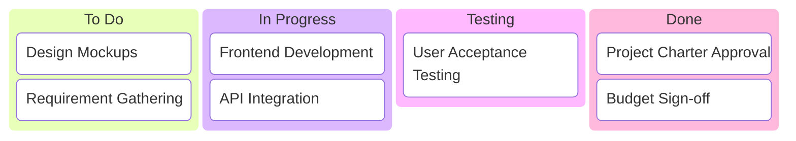

# Building a Robust Project Plan

## 1. The Components of a Project Plan
[cite_start]A project plan is a living artifact that acts as a roadmap for the team[cite: 265]. [cite_start]While the project schedule is at the center, a comprehensive plan connects several other critical components[cite: 268].

* [cite_start]**Scope and Goals:** Initially captured in the project charter, these details remind the team of objectives and prevent scope creep[cite: 269, 271].
* [cite_start]**Work Breakdown Structure (WBS):**  A hierarchical tool that breaks work into manageable pieces[cite: 272, 273]. [cite_start]It clarifies task owners, descriptions, and due dates[cite: 274].
* [cite_start]**Budget:** This must be managed and monitored throughout the lifecycle[cite: 279]. [cite_start]Regular check-ins are required if the budget is managed by an external department[cite: 284].
* [cite_start]**Management Plans:** These include sub-plans for change management, risk management, and communication[cite: 285].

---

## 2. The Planning Fallacy & Time Estimation
[cite_start]One of the root causes of project failure is flawed time estimation[cite: 290].

* [cite_start]**The Planning Fallacy:** This is the tendency to underestimate the time, costs, and risks required to complete a task due to **optimism bias**[cite: 326].
* [cite_start]**Optimism Bias:** The belief that one is less likely to experience negative events (e.g., believing you can walk the dog between meetings without considering delays)[cite: 327, 330].
* [cite_start]**The Solution:** Project managers must be "optimistically realistic"[cite: 336]. [cite_start]This involves pushing for best outcomes while planning for buffers and risks[cite: 336].

---

## 3. The Critical Path Method (CPM)
[cite_start]The critical path is the list of milestones and mandatory tasks required to complete the project on schedule[cite: 352]. [cite_start]It identifies which tasks, if delayed, will negatively impact the final project deadline[cite: 355].

### Steps to Create a Critical Path 
1.  [cite_start]**Capture all tasks:** Focus on "need to do" essentials rather than "nice to do" items[cite: 358, 361].
2.  [cite_start]**Set dependencies:** Determine which tasks must be finished before others can begin[cite: 362, 363].
3.  [cite_start]**Create a network diagram:** Visualize the sequence of tasks[cite: 367].
4.  [cite_start]**Make time estimates:** Consult stakeholders for accurate duration estimates[cite: 373].
5.  [cite_start]**Find the path:** Calculate the longest path of essential tasks to determine the shortest possible project duration[cite: 381].

### Mermaid Diagram: Critical Path Example (Building a House)
[cite_start]*Based on the example provided in the text[cite: 362, 367].*

```mermaid
graph LR
    A[Excavation] --> B[Foundation]
    B --> C[Framing]
    
    subgraph Parallel Tasks
    C --> D[Roof]
    C --> E[Plumbing]
    C --> F[HVAC]
    C --> G[Electrical]
    end
    
    E --> H[Insulation]
    F --> H
    G --> H
    
    H --> I[Drywall + Paint]
    I --> J[Flooring]
    
    style A fill:#ffcccc,stroke:#333,stroke-width:2px
    style B fill:#ffcccc,stroke:#333,stroke-width:2px
    style C fill:#ffcccc,stroke:#333,stroke-width:2px
    style H fill:#ffcccc,stroke:#333,stroke-width:2px
    style I fill:#ffcccc,stroke:#333,stroke-width:2px
    style J fill:#ffcccc,stroke:#333,stroke-width:2px

Here is the comprehensive Markdown file based on the provided text, including summaries, citations, and Mermaid diagrams.

Markdown

# Building a Robust Project Plan

## 1. The Components of a Project Plan
[cite_start]A project plan is a living artifact that acts as a roadmap for the team[cite: 265]. [cite_start]While the project schedule is at the center, a comprehensive plan connects several other critical components[cite: 268].

* [cite_start]**Scope and Goals:** Initially captured in the project charter, these details remind the team of objectives and prevent scope creep[cite: 269, 271].
* [cite_start]**Work Breakdown Structure (WBS):**  A hierarchical tool that breaks work into manageable pieces[cite: 272, 273]. [cite_start]It clarifies task owners, descriptions, and due dates[cite: 274].
* [cite_start]**Budget:** This must be managed and monitored throughout the lifecycle[cite: 279]. [cite_start]Regular check-ins are required if the budget is managed by an external department[cite: 284].
* [cite_start]**Management Plans:** These include sub-plans for change management, risk management, and communication[cite: 285].

---

## 2. The Planning Fallacy & Time Estimation
[cite_start]One of the root causes of project failure is flawed time estimation[cite: 290].

* [cite_start]**The Planning Fallacy:** This is the tendency to underestimate the time, costs, and risks required to complete a task due to **optimism bias**[cite: 326].
* [cite_start]**Optimism Bias:** The belief that one is less likely to experience negative events (e.g., believing you can walk the dog between meetings without considering delays)[cite: 327, 330].
* [cite_start]**The Solution:** Project managers must be "optimistically realistic"[cite: 336]. [cite_start]This involves pushing for best outcomes while planning for buffers and risks[cite: 336].

---

## 3. The Critical Path Method (CPM)
[cite_start]The critical path is the list of milestones and mandatory tasks required to complete the project on schedule[cite: 352]. [cite_start]It identifies which tasks, if delayed, will negatively impact the final project deadline[cite: 355].

### Steps to Create a Critical Path 
1.  [cite_start]**Capture all tasks:** Focus on "need to do" essentials rather than "nice to do" items[cite: 358, 361].
2.  [cite_start]**Set dependencies:** Determine which tasks must be finished before others can begin[cite: 362, 363].
3.  [cite_start]**Create a network diagram:** Visualize the sequence of tasks[cite: 367].
4.  [cite_start]**Make time estimates:** Consult stakeholders for accurate duration estimates[cite: 373].
5.  [cite_start]**Find the path:** Calculate the longest path of essential tasks to determine the shortest possible project duration[cite: 381].

### Mermaid Diagram: Critical Path Example (Building a House)
[cite_start]*Based on the example provided in the text[cite: 362, 367].*

```mermaid
graph LR
    A[Excavation] --> B[Foundation]
    B --> C[Framing]
    
    subgraph Parallel Tasks
    C --> D[Roof]
    C --> E[Plumbing]
    C --> F[HVAC]
    C --> G[Electrical]
    end
    
    E --> H[Insulation]
    F --> H
    G --> H
    
    H --> I[Drywall + Paint]
    I --> J[Flooring]
    
    style A fill:#ffcccc,stroke:#333,stroke-width:2px
    style B fill:#ffcccc,stroke:#333,stroke-width:2px
    style C fill:#ffcccc,stroke:#333,stroke-width:2px
    style H fill:#ffcccc,stroke:#333,stroke-width:2px
    style I fill:#ffcccc,stroke:#333,stroke-width:2px
    style J fill:#ffcccc,stroke:#333,stroke-width:2px
```
(Note: In a real calculation, the longest duration path through the parallel tasks becomes the critical path.)

## 4. Tools and Templates
When choosing tools, a general rule applies: use spreadsheets for simple projects and project management software for complex ones.

Key Data Points for Any Tool:


Task ID/Name: For easy referencing.


Duration: The estimated time to complete the task.


Start/Finish Dates: To track progress against the schedule.


Owner: Who is responsible for the task.

## 5. Visualizing Work: The Kanban Board

Kanban boards are visual tools used to manage workflows, highly suitable for Agile.
Structure of a Kanban Board
Columns: Represent progress, typically moving from "To Do" $\rightarrow$ "In Progress" $\rightarrow$ "Done".
Cards: Represent specific tasks8.

| Front of Card | Back of Card |
| :--- | :--- | 
| Title/ID: Quick reference. | Start Date: For metrics/tracking. | 
| Description: Brief summary of work. | Blocked Days: When work is halted. |
| Effort Estimate: e.g., Small, Medium, Large. | Finish Date: To track against goals. |

Assignee: Ideally one person per card.


