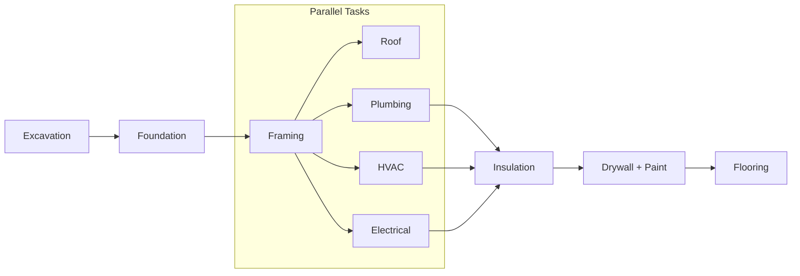
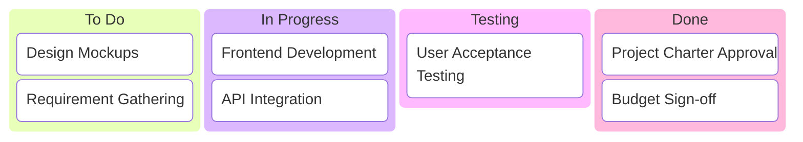

# Building a Robust Project Plan

## 1. The Components of a Project Plan
A project plan is a living artifact that acts as a roadmap for the team. While the project schedule is at the center, a comprehensive plan connects several other critical components.

* **Scope and Goals:** Initially captured in the project charter, these details remind the team of objectives and prevent scope creep.
* **Work Breakdown Structure (WBS):**  A hierarchical tool that breaks work into manageable pieces. It clarifies task owners, descriptions, and due dates.
* **Budget:** This must be managed and monitored throughout the lifecycle. Regular check-ins are required if the budget is managed by an external department].
* **Management Plans:** These include sub-plans for change management, risk management, and communication.

---

## 2. The Planning Fallacy & Time Estimation
One of the root causes of project failure is flawed time estimation.

* **The Planning Fallacy:** This is the tendency to underestimate the time, costs, and risks required to complete a task due to **optimism bias**.
* **Optimism Bias:** The belief that one is less likely to experience negative events (e.g., believing you can walk the dog between meetings without considering delays).
* **The Solution:** Project managers must be "optimistically realistic". This involves pushing for best outcomes while planning for buffers and risks.

---

## 3. The Critical Path Method (CPM)
The critical path is the list of milestones and mandatory tasks required to complete the project on schedule. It identifies which tasks, if delayed, will negatively impact the final project deadline.

### Steps to Create a Critical Path 
1.  **Capture all tasks:** Focus on "need to do" essentials rather than "nice to do" items.
2.  **Set dependencies:** Determine which tasks must be finished before others can begin.
3.  **Create a network diagram:** Visualize the sequence of tasks.
4.  **Make time estimates:** Consult stakeholders for accurate duration estimates.
5.  **Find the path:** Calculate the longest path of essential tasks to determine the shortest possible project duration.

### Mermaid Diagram: Critical Path Example (Building a House)
*Based on the example provided in the text.*

(Note: In a real calculation, the longest duration path through the parallel tasks becomes the critical path.)

## 4. Tools and Templates
When choosing tools, a general rule applies: use spreadsheets for simple projects and project management software for complex ones.

Key Data Points for Any Tool:

Task ID/Name: For easy referencing.

Duration: The estimated time to complete the task.

Start/Finish Dates: To track progress against the schedule.

Owner: Who is responsible for the task.

## 5. Visualizing Work: The Kanban Board

Kanban boards are visual tools used to manage workflows, highly suitable for Agile.
Structure of a Kanban Board
Columns: Represent progress, typically moving from "To Do" $\rightarrow$ "In Progress" $\rightarrow$ "Done".

| Front of Card | Back of Card |
| :--- | :--- | 
| Title/ID: Quick reference. | Start Date: For metrics/tracking. | 
| Description: Brief summary of work. | Blocked Days: When work is halted. |
| Effort Estimate: e.g., Small, Medium, Large. | Finish Date: To track against goals. |

Assignee: Ideally one person per card.

