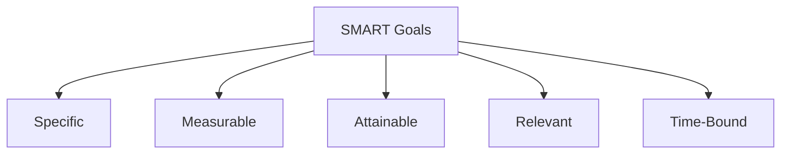
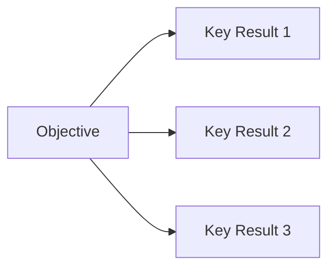
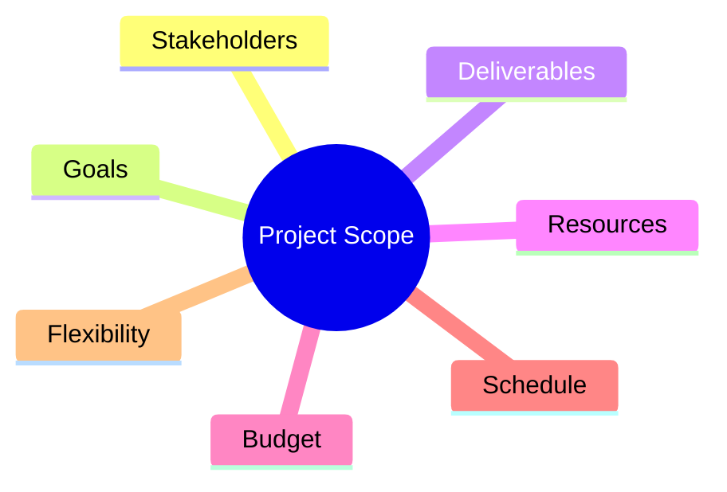
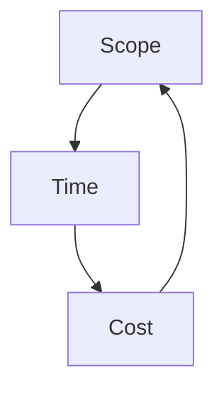

# Project Initiation — Goals, Scope, and Success (Instructor Summary)

---

## 1. Defining Project Goals — *What Are We Trying to Achieve?*

> 🎯 **Project goals describe the desired outcomes of the project.**  
> They explain **why the project exists** and **what success looks like**.

### Characteristics of Strong Project Goals
- Clearly defined
- Specific and measurable
- Aligned with business needs
- Understood by stakeholders

### Examples of Project Goals
- Reduce customer response time by 30%
- Increase revenue by 15% within one year
- Improve user satisfaction scores

> 🧠 **Instructor Insight:**  
> If you cannot measure a goal, you cannot manage it.

---

## 2. Understanding Project Deliverables — *What Will We Produce?*

> 📦 **Deliverables are the tangible or intangible outputs created to meet project goals.**

### Examples of Deliverables
- Email templates
- New service launch
- Training materials
- Software features

### Why Deliverables Matter
- They make progress visible
- They define accountability
- They help quantify project impact

> 📌 **Key Distinction:**  
> Goals = *why*  
> Deliverables = *what*

---

## 3. Importance of Clarity and Communication

> 🗣️ **Misalignment causes rework, delays, and frustration.**

### Best Practices
- Ensure shared understanding of goals and deliverables
- Engage stakeholders early
- Clarify expectations before execution begins

> 🧠 **Instructor Insight:**  
> Most project failures are communication failures—not technical ones.

---

## 4. SMART Goals — *The Gold Standard*

### SMART Breakdown

- Specific: Clear purpose, scope, and expectations

- Measurable: Quantifiable metrics track progress

- Attainable: Challenging but realistic

- Relevant: Aligned with organizational priorities

- Time-Bound: Defined deadlines

## 5. Zooming In on “M” — *Measurable Goals*

📏 Measurable goals reduce ambiguity and improve accountability.

### Good Metrics

- Revenue generated

- Number of features delivered

- Issues resolved per day

### Poor Metrics

- Number of meetings attended

- Hours spent without outcome linkage

🧠 Instructor Rule:
Not every metric has value. Measure what drives results.

## 6. Understanding OKRs (Objectives & Key Results)

🎯 OKRs combine ambition (Objective) with evidence (Key Results).

### Definitions

- Objective: What you want to achieve

- Key Results: Measurable outcomes that define success

### OKR Levels

- Company-level (annual, shared)

- Department-level

- Project-level (defined during initiation)

📌 Alignment Rule:
Project OKRs must support company and department OKRs.

## 7. Asking Scope-Defining Questions — Avoid Guesswork

📐 Scope defines the boundaries of the project.

### Why Scope Matters

- Identifies resources and costs

- Defines schedule

- Prevents confusion and scope creep

### Scope-Defining Question Areas

Example Questions

### Stakeholders

Who requested this?

Who approves scope changes?

### Goals

Why are we doing this?

What problem are we solving?

### Deliverables

What exactly will be updated or built?

### Resources

People, equipment, contractors?

### Budget

Fixed or flexible?

### Schedule

Deadline and milestones?

### Flexibility

Priority: time, cost, or quality?

🧠 Instructor Insight:
If you’re missing the who, what, when, why, or how — keep asking.

## 8. Scope Management & Preventing Scope Creep

⚠️ Scope creep = unapproved expansion of work.

### Best Practices for Scope Control

- Define and document requirements early

- Set a clear schedule

- Explicitly define what is out of scope

- Use change control processes

- Offer alternatives and cost-benefit analysis

- Learn when to say no

- Track costs for out-of-scope work

📌 Reality Check:
Every scope change affects time, cost, or quality.

## 9. Understanding Project Scope & the Triple Constraint

🔺 Triple Constraint: Scope, Time, Cost
Change one → impacts the others.

### PM’s Core Responsibility

Deliver the project:

- Within agreed scope

- On time

- Within budget

## 10. Launching vs. Landing a Project

🚀 Launch = deliver the output
🎯 Land = achieve the intended outcome

### Example

Launch: Training program delivered

Land: Recycling increased by 20%

❌ Common Mistake: Launch and forget
✅ Best Practice: Launch first, land later

## 11. Tracking & Communicating Success Criteria
### Dimensions of Success

- Product quality

- Customer satisfaction

- Stakeholder expectations

### Product Quality Metrics

- Features completed

- Defect counts

- Usability measures

### Stakeholder & Customer Metrics

- Adoption rates

- Engagement metrics

- Satisfaction surveys

📌 Instructor Insight:
Success must be agreed upon—not assumed.

## 12. Using OKRs to Evaluate Progress
### Tracking OKRs

Share OKRs with the team

Assign owners to each Key Result

Conduct regular check-ins

### Scoring OKRs

Yes / No

Percentage completed

Scale (0.0 – 1.0)

Traffic light (Red / Yellow / Green)

🧠 Industry Benchmark:
60–70% achievement = ambitious and healthy

## 13. Final Instructor Takeaway

✅ Clear goals drive scope
✅ Scope enables planning
✅ Metrics define success
✅ Communication prevents failure

🧠 Initiation sets the foundation.
Weak initiation guarantees future problems.