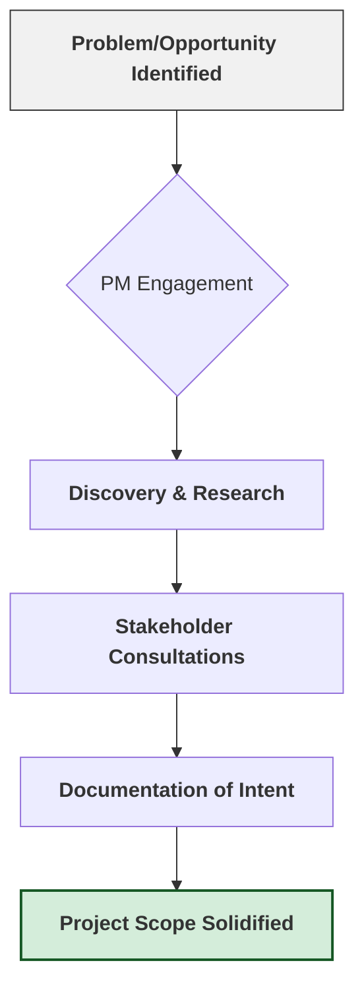
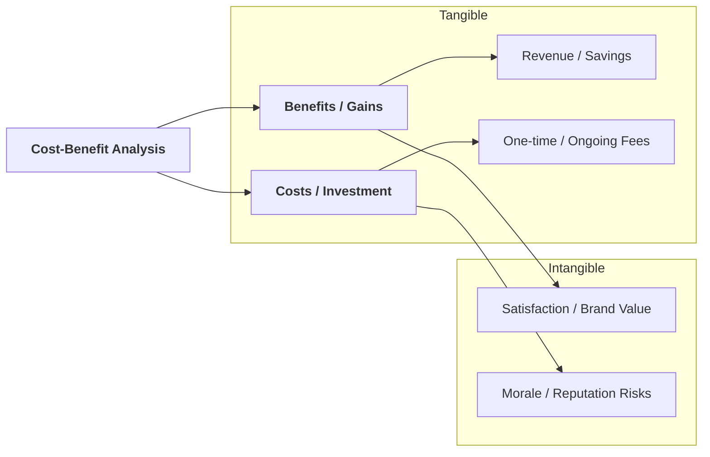
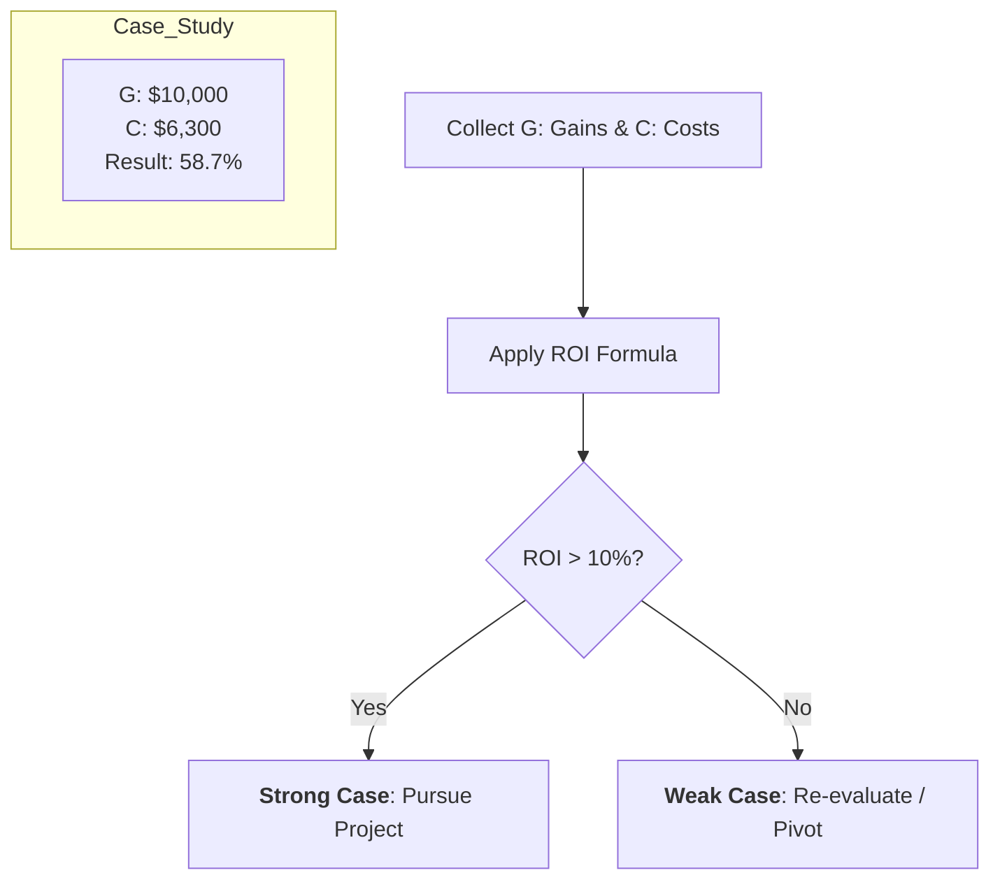

# Project Management Professional Series: Initiation Phase

## 1. Executive Overview
Project Initiation is the **foundational phase** of the project life cycle. It is the process of defining a new project or a new phase of an existing project by obtaining authorization to start. This phase ensures that the organization isn't just doing a project, but doing the *right* project for the *right* reasons.

---

## 2. The Project Manager’s Foundation
The PM's primary role during initiation is to bridge the gap between a high-level idea (from stakeholders) and a structured plan.

### Initiation Workflow

mindmap
  root((Initiation))
    Goals
      Objectives
      Alignment
    Scope
      In-scope
      Out-of-scope
    Deliverables
      Tangible
      Intangible
    Success_Criteria
      KPIs
      Metrics
    Stakeholders
      Internal
      External
    Resources
      Budget

      Personnel

