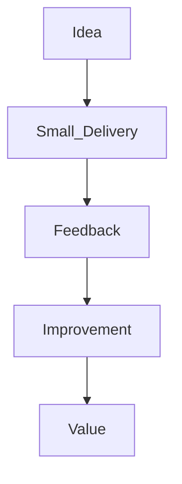
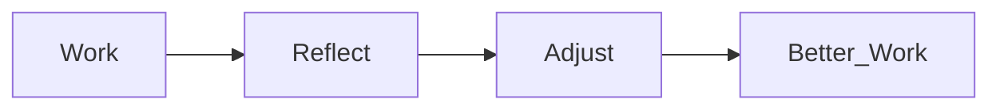
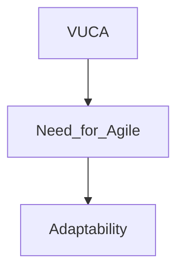
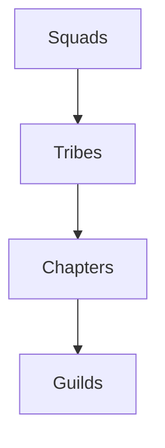

# Agile Project Management
## Values, Principles, Frameworks, and Scaling Models

---

## 1. Value Delivery — *Deliver Early, Learn Fast*

> 🎯 **Agile exists to deliver value quickly and continuously.**

### Core Ideas
- Deliver work early to gather feedback
- Reduce risk of building the wrong product
- Focus on **simplicity** and essential features
- Let user feedback guide priorities

> 🧠 **Memory Hook:**  
> If users can’t see it, they can’t validate it.

## 2. Business Collaboration — No Silos

🤝 Agile breaks the wall between business and delivery teams.

### Why Collaboration Matters

Ensures alignment with business goals

Reduces misunderstandings

Improves decision speed

### Practical Collaboration Methods

Co-located teams (or virtual equivalents)

Daily interactions

Regular feedback sessions

Shared priorities and goals

📌 Exam Tip:
Agile favors collaboration over contracts.

## 3. Team Culture and Dynamics — People First

👥 Agile teams thrive on trust, empowerment, and inclusion.

### Key Cultural Principles

Inclusive and supportive environments

Psychological safety

Team ownership of processes and tools

Shared accountability

🧠 Instructor Insight:
Empowered teams outperform controlled teams.

## 4. Retrospectives & Continuous Learning

🔄 Agile teams improve by reflecting regularly.

Purpose of Retrospectives

Identify what worked

Identify what didn’t

Adapt behaviors and practices

📌 Exam Tip:
Continuous improvement is non-negotiable in Agile.

## 5. Agile Manifesto — The Foundation
### The Four Agile Values

Individuals and interactions over processes and tools

Working software over comprehensive documentation

Customer collaboration over contract negotiation

Responding to change over following a plan

🧠 Key Reminder:
Items on the right have value — but Agile prioritizes the left.

## 6. The 12 Agile Principles — Explained Simply
### Customer Value & Delivery

Deliver valuable work early and often

Welcome changing requirements

Deliver frequently, preferably in short cycles

### Collaboration & People

Business and developers work together daily

Build around motivated individuals

Face-to-face communication is most effective

### Measurement & Sustainability

Working product is the primary progress measure

Maintain a sustainable pace

Prioritize technical excellence and good design

### Simplicity & Team Autonomy

Maximize work not done

Let self-organizing teams design solutions

Reflect and adjust regularly

📌 Exam Shortcut:
Agile success = value + feedback + adaptation.

## 7. Agile and VUCA — Why Agile Exists

🌪️ Agile thrives in uncertainty.

### VUCA Defined

Volatility: Rapid change

Uncertainty: Unpredictable outcomes

Complexity: Many interrelated factors

Ambiguity: Unclear cause-and-effect

🧠 Rule of Thumb:
High VUCA → Agile approach recommended.

## 8. Office Green Scenario — Agile in Action
### The Challenge

Sudden shift to home offices

No existing project plan

High volatility and uncertainty

### Agile Benefits

Fast response

Flexible planning

Reduced risk

Continuous feedback

📌 Lesson:
Agile is not about speed — it’s about survival in change.

## 9. Scrum — Origins and Purpose

🏉 Scrum is about teamwork and momentum.

Named after rugby

Introduced in 1986 (Harvard Business Review)

Used by ~72% of Agile teams

### Scrum Is:

Lightweight

Iterative

Team-centric

## 10. Core Components of Scrum
### Scrum Artifacts

Product Backlog: Prioritized work list

Sprint Backlog: Selected work for a sprint

Increment: Working product

### Scrum Events

Sprint (1–4 weeks)

Daily Scrum

Sprint Review

Sprint Retrospective

### Scrum Roles

Product Owner: Maximizes value

Scrum Master: Facilitates Agile practice

Development Team: Builds the product (3–9 people)

## 11. What Makes Scrum Unique (Takeuchi & Nonaka)

### Key Characteristics:

Built-in instability

Self-organizing teams

Overlapping development

Multi-learning

Subtle control

Organizational learning

🧠 Instructor Insight:
Scrum works because all parts reinforce each other.

## 12. Kanban — Visual Flow Management

📋 Kanban makes work visible.

### Key Concepts

Visual boards

Work-in-progress (WIP) limits

Continuous flow

📌 Exam Tip:
Kanban = flow, not iterations.

## 13. Extreme Programming (XP)

🧪 XP emphasizes quality and feedback.

### Key Practices:

Test-first development

Simple design

Continuous testing

Strong customer collaboration

## 14. Lean Methodology

🏭 Lean focuses on eliminating waste.

### Five Lean Principles

Define value

Map the value stream

Create flow

Establish pull

Pursue perfection

🧠 Lean Question:
Does this activity add value?

## 15. Agile vs. Waterfall — And Blending Both
### Waterfall Characteristics

Sequential phases

Fixed plans

Predictable environments

When to Blend

Regulatory constraints

Stakeholder expectations

Hybrid teams

📌 Exam Tip:
Hybrid ≠ wrong — context matters.

## 16. Spotify Model — Scaling Agile

🎵 Spotify scales Agile without killing autonomy.

Structural Elements

Squads: Small, autonomous teams

Tribes: Groups of squads (<100 people)

Chapters: Skill-based groups

Guilds: Communities of interest

⚠️ Important Warning:
Be inspired — don’t copy blindly.