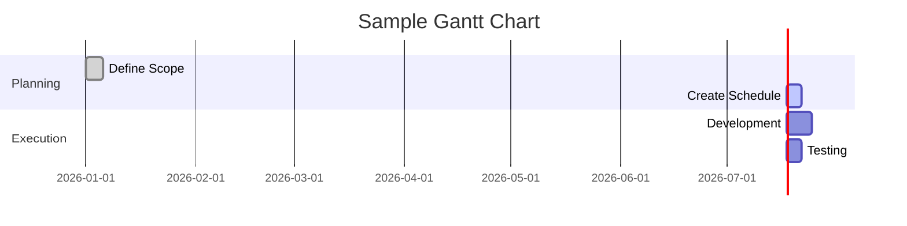
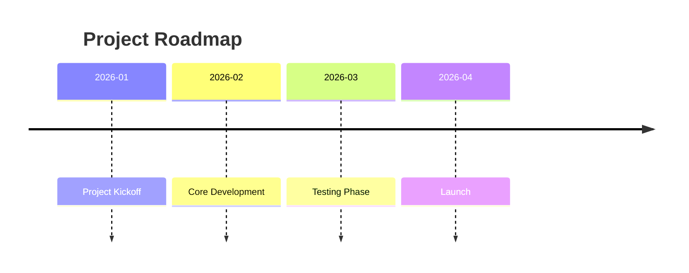
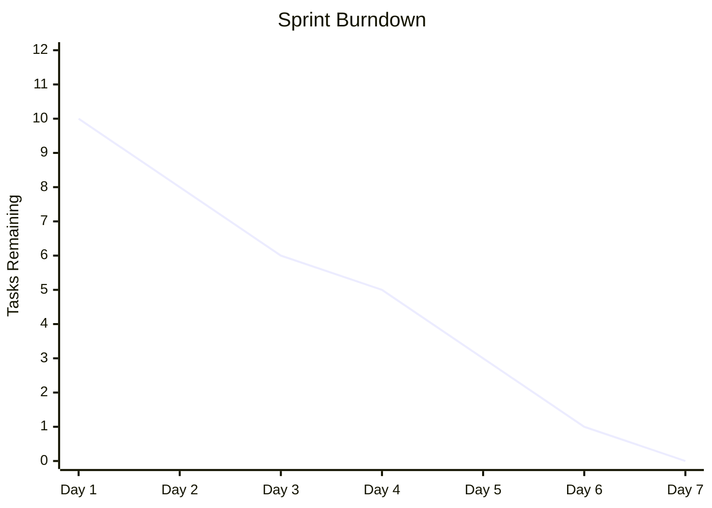
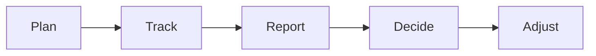
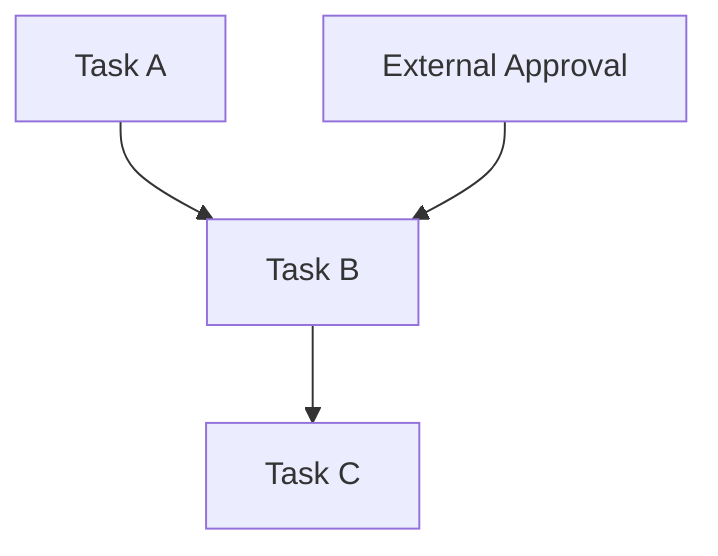
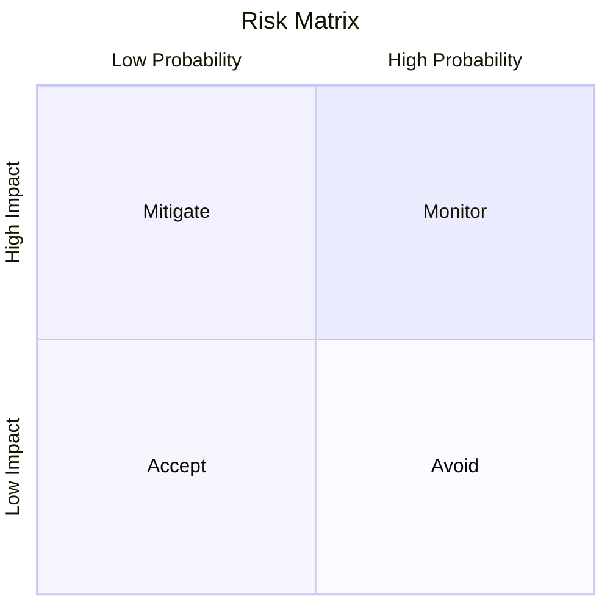
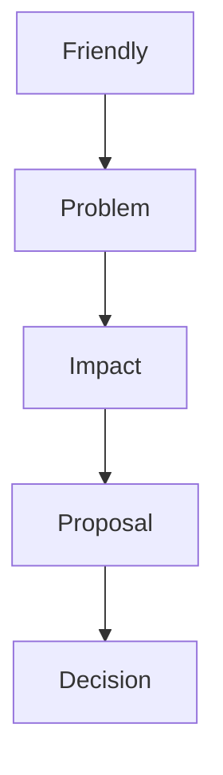

# 📊 Tracking, Measurement, and Control

Progress Monitoring, Risk, Change, and Escalation

## 🎯 Tracking and Measurement
### 📘 Definition

Tracking is the process of monitoring project activities to compare actual progress against the project plan.

Tracking helps project managers:

Identify deviations early

Take corrective action

Keep projects aligned with goals

Deviation Insight:
Deviations can be positive (ahead of schedule) or negative (delays, cost overruns).

## ✅ Benefits of Tracking
### 🔍 Transparency

Centralizes project information

Enables informed decision-making

Ensures shared understanding of project status

### 📣 Communication

Keeps teams and stakeholders aligned

Clarifies deadlines, goals, and priorities

### ⚠️ Risk Management

Detects risks and issues early

Enables proactive corrective actions

### 💪 Confidence

Builds trust with stakeholders

Motivates teams by showing progress

Keeps scope, schedule, and budget under control

## 🗓 What Should Be Tracked?
### ⏱ Project Schedule

Tasks and activities

Milestones

Action item status

### 💰 Cost Tracking

Spending vs. budget

Overspending or underspending

Budget impact awareness

Note:
Even if you don’t own the full budget, you must understand cost implications.

### 🔁 Decisions, Risks, and Dependencies

Track:

Key decisions

Approved changes

Dependencies

Risks and mitigations

## 📈 Common Tracking Tools
### 📊 Gantt Chart

Definition:
A Gantt chart visualizes tasks against time, showing:

Task duration

Dependencies

Ownership

Best for:

Large projects

Many dependencies

Clear accountability

### 🛣 Roadmap

Definition:
A roadmap provides a high-level view of major milestones and how the project evolves over time.

Best for:

Executive updates

Long-term planning

Strategic alignment

### 🔥 Burndown Chart

Definition:
A burndown chart shows remaining work versus time.

Best for:

Agile / Scrum teams

Tight deadlines

Scope creep visibility

### 🧭 Choosing the Right Tracking Method
| Tool	| Best Use Case |
| :--- | :--- | 
| Gantt Chart |	Complex projects with dependencies |
| Roadmap |	High-level milestone tracking |
| Burndown Chart |	Agile teams, sprint progress |
| Status Report	| Snapshot communication |

## 🧾 Project Status Reports
### 📘 Definition

A project status report provides a snapshot of project health at a specific point in time.

### 🔑 Key Components

Project Name – Clear and specific

Date – Tracks progress over time

Summary – Highlights and lowlights

Status (RAG) – Red / Amber / Green

Milestones & Tasks – Completed and upcoming

Issues & Risks – Roadblocks and mitigation

🚦 RAG Status Explained
| Color |	Meaning |
| :--- | :--- | 
| 🟢 Green |	On track |
| 🟡 Amber |	At risk, corrective action needed |
| 🔴 Red |	Off track, escalation required |

## 🔄 Managing Changes
### 📘 Definition

Changes are alterations to tasks, scope, structure, or processes.

Common Change Types:

Scope creep

New dependencies

Budget constraints

Priority shifts

Force majeure events

Responsibility:
The project manager owns change management.

### 📝 Change Management Tools

Statement of Work (SoW)

Change Request Forms

A good change request includes:

Project details

Reason for change

Impact analysis

Proposed solution

### 🔗 Dependency Management
Types of Dependencies
| Type |	Description |
| :--- | :--- | 
| Internal | Within the project |
| External |	Outside project control |
| Mandatory |	Contractual or legal |
| Discretionary |	Defined by the team |

## ⚠️ Risk Management Overview
### 📘 Definition

Risk management identifies and prepares for potential events that could impact:

Schedule

Cost

Scope

Quality

### 🧠 Risk Prioritization

Risks are evaluated using:

Probability

Impact

### 🧩 ROAM Technique
| Category |	Meaning |
| :--- | :--- | 
| Resolved |	No longer a risk |
| Owned |	Assigned to someone |
| Accepted |	No action needed |
| Mitigated |	Reduction plan in place |

## 🚨 Escalation in Project Management
### 📘 Definition

Escalation is seeking help from higher-level leadership to:

Remove blockers

Clarify priorities

Make decisions

Escalation is a positive, professional practice.

### ⏰ When to Escalate

Threats to milestones

Budget overruns

Timeline risks

Team deadlocks

## ✉️ Writing an Effective Escalation Email
### ✅ Best Practices

An effective escalation email should:

Maintain a friendly tone

State your role and connection

Explain the problem clearly

Describe consequences

Propose a solution and request help

### 🔁 Retrospectives and Timeouts
⏸ Timeouts

Used when:

Scope changes significantly

Team structure changes

Priorities shift

### 🔄 Retrospectives

Regular meetings to:

Reflect on successes

Learn from setbacks

Improve future performance

Rule:
Focus on learning, not blame.

### 🧠 Key Takeaways

Tracking enables early intervention

Choose tools based on project needs

Status reports drive alignment

Risk and dependency management prevent surprises

Escalation supports faster decisions
