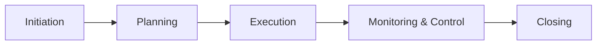
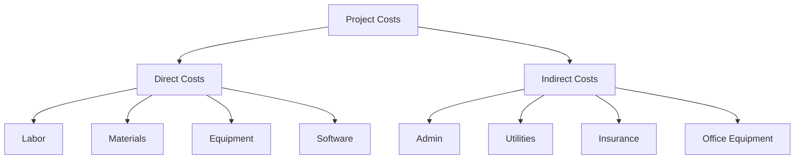
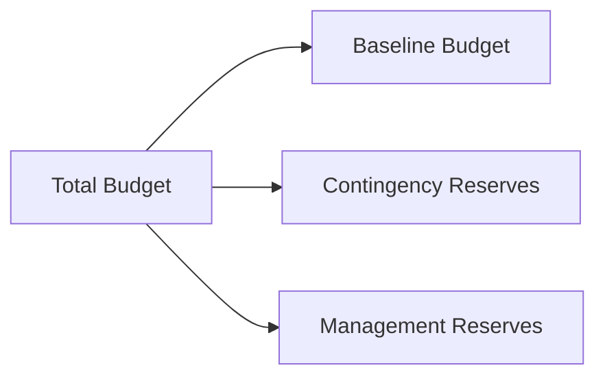
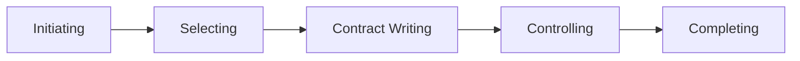

# Project Budgeting & Procurement — Clear Summary with Examples

## 1. Project Budgeting Overview
### Definition

A project budget is an estimate of the total monetary resources required to achieve a project’s goals and objectives.

It breaks costs down by:

Milestones

Activities

Tasks

This ensures accurate cost tracking and control.

### Example

A mobile app project budget may include:

Design milestone: UX/UI cost

Development milestone: developer salaries

Testing milestone: QA tools and labor

## 2. Budgeting Process & Collaboration
### Key Idea

Budgeting starts in Initiation and Planning, but continues throughout the entire project lifecycle.

Project managers:

Estimate costs

Review assumptions

Get approvals from stakeholders

Ensure compliance with company policy

### Example

Even after approval, a budget may change if:

Scope increases

Resources change

Risks occur

## 3. Why Budgeting Matters
Significance

### A project budget:

Is a formal deliverable

Acts as a success metric

Affects company profitability and future funding

### Example

If Project A exceeds its budget by 30%, management may:

Reduce funding for future projects

Reject similar proposals

## 4. Understanding Stakeholder Needs
### Definition

Stakeholders are individuals or groups affected by the project’s outcome.

Project managers must:

Understand stakeholder priorities

Budget for unexpected expenses

Communicate cost impacts clearly

### Example

A stakeholder may prioritize speed over cost, requiring:

Overtime pay

Additional contractors

## 5. Reviewing & Reforecasting
Definition

Reviewing: Checking actual vs planned costs

Reforecasting: Updating future cost estimates based on reality

### Example

If cloud hosting costs increase mid-project:

Update remaining budget

Adjust forecasts for upcoming months

## 6. Key Budgeting Factors
Critical Elements

Resource cost rates (hourly wages)

Contingency reserves

Management reserves

Cost of quality

### xample

Adding a contingency budget to handle:

Rework

Delays

Vendor price increases

## 7. Types of Project Costs

### Direct Costs (Examples)

Developer salaries

Software licenses

Travel for project work

### Indirect Costs (Examples)

Office rent

IT support

Utilities

## 8. Baseline Budget
### Definition

A baseline budget is the approved version of the project budget used to measure performance.

Key Rule

If scope, schedule, or cost changes significantly → re-baseline required

### Example

If a new feature is approved:

Update cost estimates

Get approval

Establish a new baseline

## 9. Reserve Analysis
Contingency Reserves

For identified risks

Example: buffer for possible overtime costs

Management Reserves

For unknown risks

Usually 5–10% of total budget

Requires sponsor approval

## 10. Cost of Quality (CoQ)
### Definition

All costs required to ensure quality and fix defects.

### Example

A defect causes:

Product redesign

Refunds

Additional testing costs

## 11. Budget Creation Techniques
Bottom-Up Budgeting

Estimate cost of each task

Roll up to milestones and total budget

### Example

Task-based estimates for:

Research

Development

Testing

## 12. Budget Monitoring & Cost Control
### Best Practices

Review budget at milestones

Track variances early

Require sign-off for cost changes

Implications of Variance

Over budget → funding risk

Under budget → poor estimation or planning gaps

## 13. Common Budgeting Challenges
Challenge 1: Budget Pre-allocation

Budget is fixed before scope is defined.

Solution:

Align scope to budget

Track costs closely

Challenge 2: Incorrect TCO (Total Cost of Ownership)
Definition

TCO includes lifecycle costs, not just purchase price.

### Example

Software cost includes:

License

Maintenance

Upgrades

Support

Challenge 3: Scope Creep
Definition

Uncontrolled changes that expand scope and increase cost.

Causes

Vague SOW

Undocumented agreements

Last-minute stakeholder requests

## 14. Key Budgeting Terms
Cash Flow

Money flowing into and out of the project.

Example

If expenses exceed income → project risk increases

CAPEX vs OPEX
Term	Meaning	Example
CAPEX	Long-term investment	Servers, equipment
OPEX	Operational costs	Salaries, rent
## 15. Procurement Overview
### Definition

Procurement is acquiring external:

Materials

Services

Supplies

Example

Hiring external copywriters when internal staff is unavailable.

## 16. Procurement Process (5 Steps)

## 17. Key Procurement Documents
Document	Purpose
NDA	Protect confidential info
RFP	Request vendor proposals
SOW	Define work and deliverables
## 18. Ethics in Procurement
Ethical Values

Honesty

Responsibility

Respect

Fairness

Common Ethical Traps

Bribery

Sole-supplier sourcing

Government regulation violations

Ethical Test

Ask:

Is it legal?

Would I be ashamed?

Are consequences acceptable?

Final Learning Tip

Think of budgeting and procurement as:

Financial + ethical decision-making tools that protect both the project and your career.