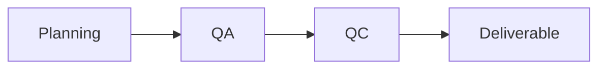
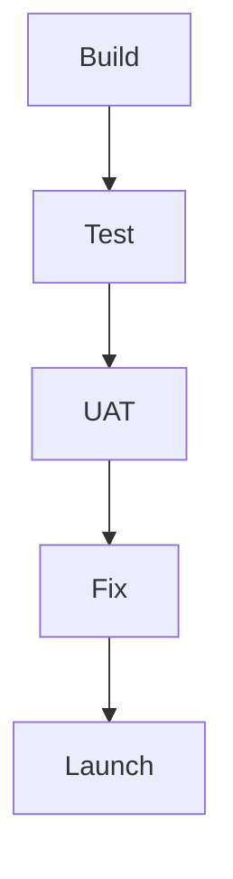
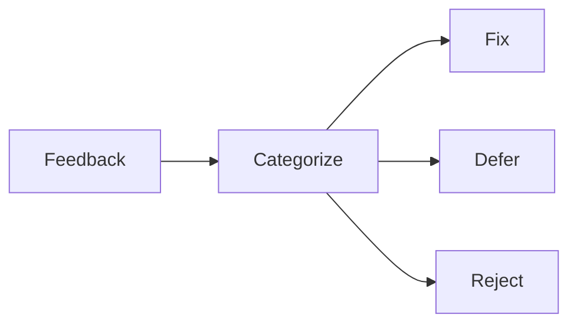
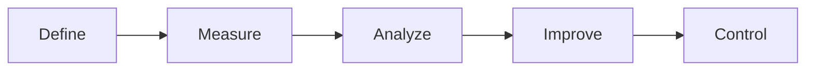
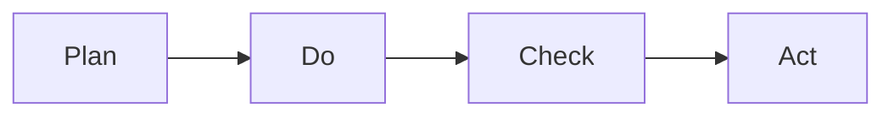
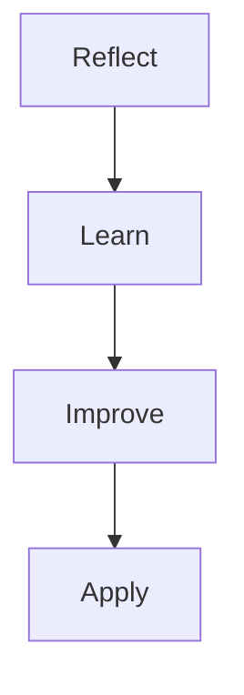

# ✅ Quality Management, User Testing, and Continuous Improvement
## 🏆 Quality Management Concepts
### 📘 Quality Standards

Quality standards define the requirements, specifications, or guidelines that a product, process, or service must meet to be considered successful.

Why they matter

Reduce rework

Prevent schedule delays

Align expectations with customers

Example

A mobile app must load within 3 seconds and meet accessibility WCAG standards to be accepted.

🛠 Quality Planning

Quality planning determines:

Which quality standards apply

How the team will meet them

Key outputs

Quality procedures

Checklists

Acceptance criteria

### 🔍 Quality Assurance (QA)

QA is a process-focused, preventive activity.

Purpose

Ensure processes are followed

Confirm the project is on track to meet quality standards

Examples

Process audits

Compliance reviews

### 🧪 Quality Control (QC)

QC is a product-focused, corrective activity.

Purpose

Identify defects after they occur

Fix issues in deliverables

Relationship

QA prevents defects

QC detects defects

## 🤝 Soft Skills in Customer Communication
Key Skills

Negotiation

Empathetic listening

Trust-building

Asking open-ended questions

Example

“What would success look like for you?” instead of “Is this acceptable?”

### 🎯 Managing Customer Expectations

Best practices

Set update cadence early

Share relevant information only

Use judgment during troubleshooting

Risk

Oversharing can cause confusion; undersharing erodes trust.

### 🔁 Feedback and Continuous Improvement

Why feedback matters

Bridges expectation gaps

Improves future projects

Increases customer satisfaction

When to collect

During the project (iterative improvement)

After completion (lessons learned)

## 👩‍💻 User Testing Methods
### 📋 Feedback Surveys

Collect opinions

Identify likes/dislikes

### ✅ User Acceptance Testing (UAT)

UAT ensures the product works for real users in real conditions.

When

Near the end of development

### 🎯 Goals of UAT

Validate real-world behavior

Confirm expected functionality

Identify issues before launch

Evaluate usability and accessibility

### 🧪 Conducting User Acceptance Testing
Typical UAT Agenda

Welcome users

Present product

Demonstrate features

Explore critical user journeys

Collect feedback

Identify bugs and improvements

### 🧩 Edge Cases

Edge cases are rare or unexpected scenarios not considered during development.

Example

Uploading extremely large files or using assistive technologies.

### ♿ Accessibility in Feedback Collection
Inclusive Practices

Live captioning

Interpreters

Accessible physical spaces

Advance access to questions

Integration Strategy

Include accessibility from day one

Train developers early

Test with users with disabilities

### 🧾 UAT Best Practices

| Step | Description |
| :--- | :--- | 
| Acceptance Criteria |	Define success upfront |
| Test Cases |	Real end users only |
| User Selection |	Define success upfront |
| Scripts |	Based on user stories |
| Communication |	Prepare users in advance |
| Environment |	Ensure access and credentials |
| Documentation | Centralized issue tracking |	

### 📊 Managing UAT Feedback
Types of Feedback
| Type | Action |
| :--- | :--- | 
| Bugs | Prioritize and fix |
| Change Requests | Evaluate scope and impact |
| Opinions | Review for future improvements |

## 🧠 Process Improvement Mindset
Continuous Improvement

An ongoing effort to:

Enhance effectiveness

Reduce waste

Adapt to feedback and change

Controlled Experiments

Used to validate improvements.

Key concepts

Hypothesis

Control group

Measurable outcomes

Example

Shipping plants in larger boxes to reduce damage and comparing results.

### 📐 Data-Driven Frameworks
#### DMAIC

Define → Measure → Analyze → Improve → Control

#### PDCA

Plan → Do → Check → Act

### 🏗 Project, Program, and Portfolio
| Level | Focus |
| :--- | :--- | 
| Project | Single objective |
| Program | Related projects |
| Portfolio | Strategic alignment |

### 👥 Roles Overview
| Role | Responsibility |
| :--- | :--- | 
| Project Manager | Short-term execution |
| Program Manager | Long-term optimization |
| Portfolio Manager | Strategic oversight |

## 🔁 Retrospectives
### 📘 Definition

A retrospective is a structured reflection session to learn from successes and failures.

Benefits

Improves collaboration

Identifies root causes

Drives actionable improvements

Best Practices

Blameless environment

Encourage honesty

Celebrate wins

Track action items

## 🧠 Key Takeaways

Quality starts with standards

QA prevents, QC detects

UAT validates real-world usability

Accessibility is non-negotiable

Continuous improvement never ends

Retrospectives turn experience into progress
	
	
	
	
	
	
	
	
	
	