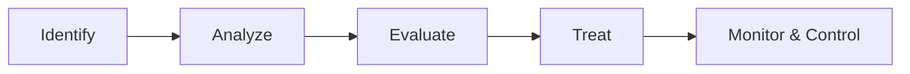
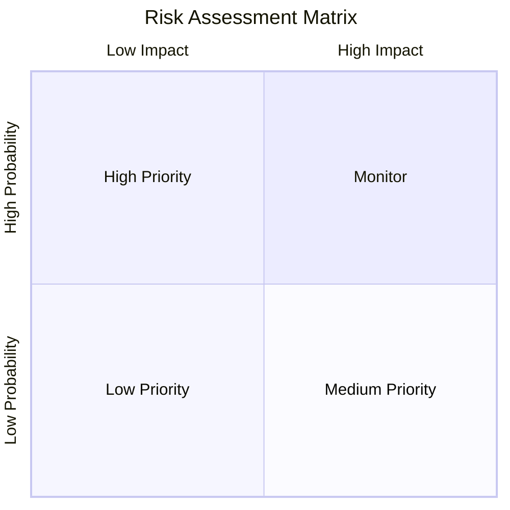
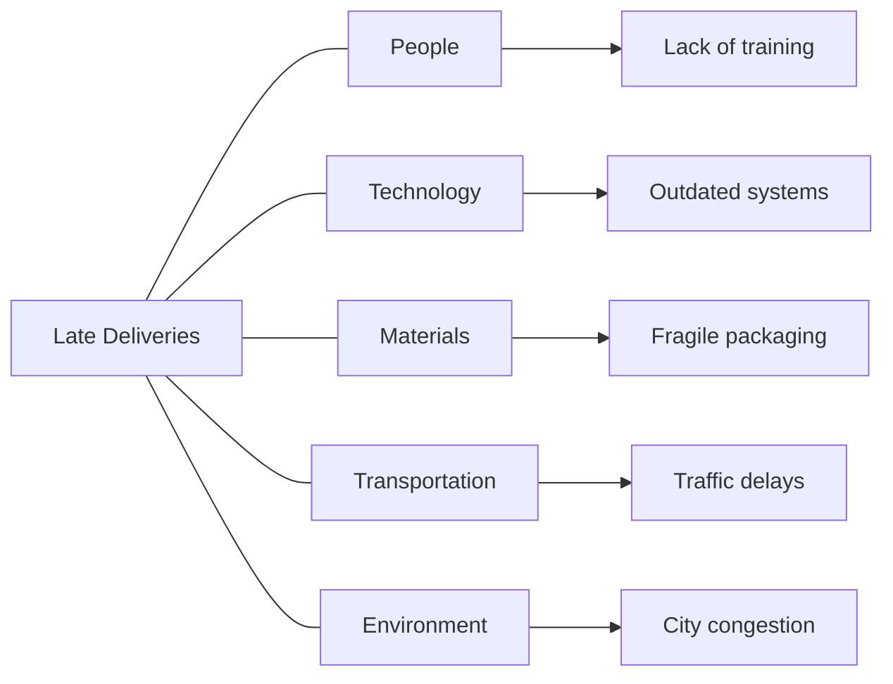
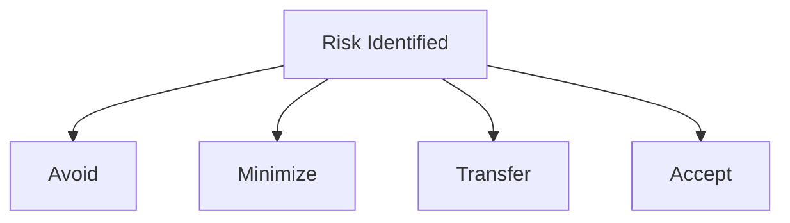
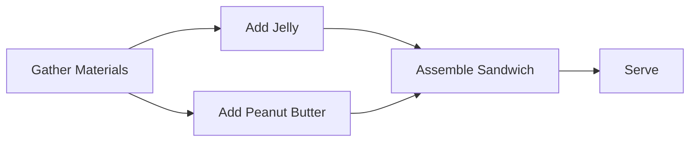

# Risk & Issue Management — Clear Summary with Examples

## 1. Understanding Risks vs. Issues
### Definitions

**Risk**: A potential event that may impact the project in the future.

**Issue**: A problem that is already happening and requires immediate action.

Key Difference
| Risk | Issue |
| :--- | :--- | 
| Hypothetical | Real |
| Future-oriented | Present |
| Planned for | Acted on immediately |	
	
		
### Example

Risk: A key vendor might miss a delivery deadline.

Issue: The vendor has already missed the delivery deadline.

## 2. What Is Risk Management?
### Definition

Risk management is the continuous process of identifying, analyzing, and responding to risks and issues throughout the project lifecycle.

Purpose

Prepare for uncertainty

Reduce negative impact

Increase chances of project success

## 3. Consequences of Poor Risk Management
### What Can Go Wrong

Missed deadlines

Budget overruns

Failed deliverables

Stakeholder dissatisfaction

Key Insight

Good risk management allows flexibility—projects can adapt when problems arise instead of failing.

## 4. The 5 Phases of Risk Management

### Phase Breakdown

Identify
List potential risks with your team.

Analyze
Determine probability and impact.

Evaluate
Prioritize risks based on severity.

Treat
Decide how to handle each risk.

Monitor & Control
Track risks and respond when needed.

## 5. Risks Can Create Opportunities
### Definition

An opportunity is a potential positive outcome that arises from uncertainty.

### Examples

Completing a milestone early

Receiving discounted materials

Gaining access to extra resources

Key Idea

Risk management is not only defensive—it also helps you capitalize on advantages.

## 6. Identifying Risks Effectively
### Brainstorming

Judgment-free discussion

Diverse team perspectives

Focus on behaviors, not individuals

### Example

A cross-functional team may identify:

Technical risks

Schedule risks

Resource availability risks

## 7. Risk Assessment Tools
### Risk Register

A document listing:

Risk description

Probability

Impact

Priority

Mitigation strategy

### Probability & Impact Matrix

## 8. Inherent Risk
### Definition

Inherent risk is the combination of:

Probability × Impact

Purpose

Helps project managers focus on the risks that matter most.

## 9. Fishbone (Ishikawa) Diagram
### Definition

A fishbone diagram is a visual tool used to identify root causes of risks or issues.

### When to Use

Planning phase → identify potential risks

Execution phase → diagnose existing issues

## 10. Common Risk Categories
### Time Risks

Tasks take longer than planned.

**Example**: Delayed approvals slow development.

### Budget Risks

Costs exceed estimates.

**Example**: Scope expansion increases contractor fees.

### Scope Risks

Deliverables do not meet expectations.

**Example**: Features unclear in the SOW.

## 11. Single Point of Failure (SPOF)
### Definition

A single point of failure is a risk that can completely stop the project.

### Example

Only one subject matter expert understands a critical system.

## 12. Risk Mitigation Strategies

### Strategy Examples

Avoid: Choose a different supplier.

Minimize: Use multiple vendors.

Transfer: Outsource responsibility.

Accept: Set aside contingency funds.

## 13. Managing Dependencies
Definition

A dependency exists when one task relies on another.

### Types of Dependencies
| Type | Meaning | Example |
| :--- | :--- | 
| Finish-to-Start (FS) | A finishes before B starts | Socks → Shoes |
| Finish-to-Finish (FF) | A finishes before B finishes | Icing → Cake decoration |
| Start-to-Start (SS) | A and B start together | Paying → Boarding train |
| Start-to-Finish (SF) | A starts before B finishes | Shift handoff |

## 14. Dependency Graph Example

## 15. Risk Management Plan
### Definition

A **risk management plan** is a living document describing:

Key risks

Risk ratings

Mitigation actions

Owners

### Typical Contents

Project name

Document owner

Status and dates

Risk register

## 16. Communicating Risks
### Best Practices

Low-risk → email updates

High-risk → meetings and documentation

Communicate early and often

### Benefit

Builds trust and aligns expectations.

## 17. Ethical Risk Awareness
### Ethical Traps

Ignoring known risks

Concealing issues

Allowing conflicts of interest

### Ethical Test Questions

Ask yourself:

Is it legal?

Would I be ashamed?

Are consequences acceptable?

## 18. Key Takeaway

You cannot eliminate all risks—but you can understand, prioritize, and manage them.

Effective risk management:

Protects timelines

Preserves budgets

Builds stakeholder confidence

Increases project success