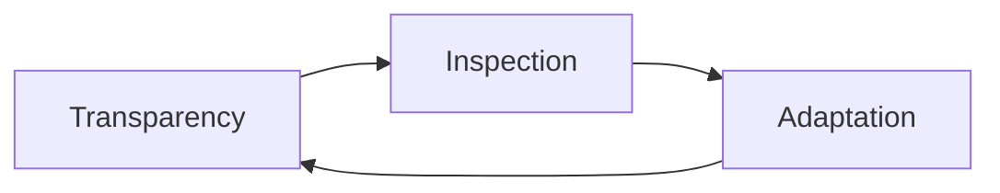
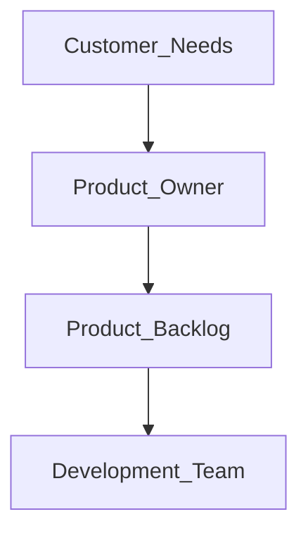
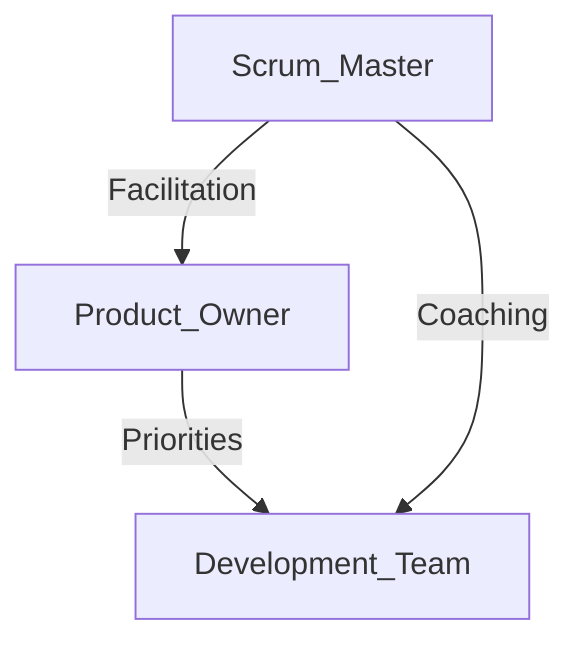

# Scrum Foundations
## Pillars, Values, and Roles

---

## 1. The Three Pillars of Scrum

> 🏛️ **Scrum is built on empiricism** — decisions are based on what is observed, not assumptions.

### Transparency
Transparency means making all important aspects of work visible to everyone involved.

- Progress, blockers, and decisions are visible
- Shared understanding among team members and stakeholders
- Builds trust and reduces costly misunderstandings

> 🧠 Transparency answers: *“What is really happening?”*

### Inspection
Inspection involves regularly examining progress toward Sprint goals.

- Happens frequently (Daily Scrum, Sprint Review)
- Detects undesirable variances early
- Enables learning and course correction

> 🧠 Inspection answers: *“Are we on track?”*

### Adaptation
Adaptation is adjusting behavior, plans, or processes when issues are discovered.

- Encourages embracing change
- Prevents repeating mistakes
- Improves future outcomes

> 🧠 Adaptation answers: *“What should we change?”*

📌 Exam Tip:
Scrum succeeds because these three pillars reinforce one another.

## 2. Scrum Values — How Teams Behave
🧭 Scrum values guide behavior so the pillars can function effectively.

### Commitment
Team members commit to achieving the Sprint Goal

Support one another through challenges

Accountability is shared

### Courage
Willingness to tackle difficult problems

Openness in raising issues and risks

Resilience in the face of uncertainty

### ocus
Concentration on Sprint work only

Avoids distractions and scope dilution

Supported by teammates

### Openness
Transparency about challenges and progress

Honest communication

Encourages learning and improvement

### Respect
Recognition of each other’s skills and contributions

Trust and professionalism

Constructive feedback

🧠 Key Insight:
Without Scrum values, the pillars collapse.

## 3. Integrating Pillars and Values
🔗 Values enable behaviors; pillars enable outcomes.

Transparency requires openness

Inspection requires courage

Adaptation requires respect and commitment

📌 Exam Shortcut:
Pillars = what Scrum does
Values = how Scrum teams behave

## 4. The Scrum Master — Servant Leader
🧑‍🏫 The Scrum Master is a coach, not a manager.

### Core Accountability
According to the Scrum Guide, the Scrum Master:

Establishes Scrum as defined in the Scrum Guide

Ensures Scrum theory and practice are understood

Is accountable for the Scrum Team’s effectiveness

### Key Responsibilities
Coaches team in self-management and cross-functionality

Removes impediments to progress

Ensures Scrum events occur and stay within timeboxes

Helps the team deliver high-value increments

Protects the Definition of Done

🧠 Timebox:
A fixed maximum duration for Scrum events.

Scrum Master vs. Project Manager
Scrum Master	Project Manager
Facilitator	Manager
Servant leader	Authority-based
Removes impediments	Manages scope, schedule, cost
No Gantt charts	Traditional planning artifacts

📌 Exam Tip:
Scrum Masters do NOT manage scope or priorities.

## 5. The Product Owner — Voice of the Customer
🎯 The Product Owner maximizes product value.

Core Responsibilities
Defines and communicates the Product Goal

Creates and prioritizes Product Backlog items

Ensures backlog transparency and clarity

Represents customer and stakeholder needs

Product Owner vs. Project Manager
Product Owner	Project Manager
Owns product scope	Owns project scope
Maximizes value	Delivers objectives
No people management	Manages team
Customer-focused	Delivery-focused

🧠 Real-World Note:
Some organizations use a Product Manager instead — always clarify role boundaries.

## 6. The Development Team — Builders of Value
🛠️ Developers turn ideas into usable increments.

### Responsibilities
Create the Sprint Backlog

Design, build, and test increments

Adhere to the Definition of Done

### Adapt plans daily

Hold each other accountable

### Key Characteristics
Cross-functional

Self-organizing

No sub-roles or hierarchy

Focused on delivering usable increments each Sprint

🧠 Cross-functional means:
The team has all skills needed to deliver value.

## 7. How Scrum Roles Work Together
🤝 Scrum succeeds through collaboration, not control.

Product Owner defines what

Development Team decides how

Scrum Master ensures Scrum is followed

## 8. Essential Traits for Scrum Roles
### Product Owner Traits
Strong communication

Clear vision

Organizational skills

Ability to prioritize for value

### Scrum Master Traits
Servant leadership

Facilitation and coaching skills

Conflict resolution

Process discipline

Development Team Traits
Collaboration

Accountability

Adaptability

Commitment to quality

🎯 Instructor Insight:
Scrum roles are about mindset, not titles.

## 9. Final Scrum Takeaways
✅ Scrum is empirical
✅ Values enable pillars
✅ Roles are complementary
✅ Transparency drives trust
✅ Adaptation drives success