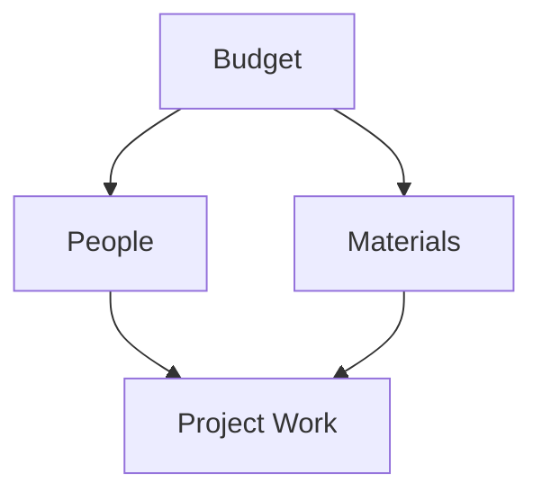
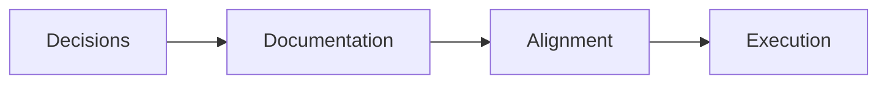
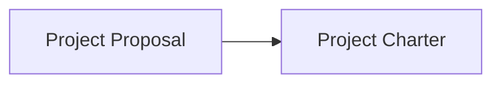
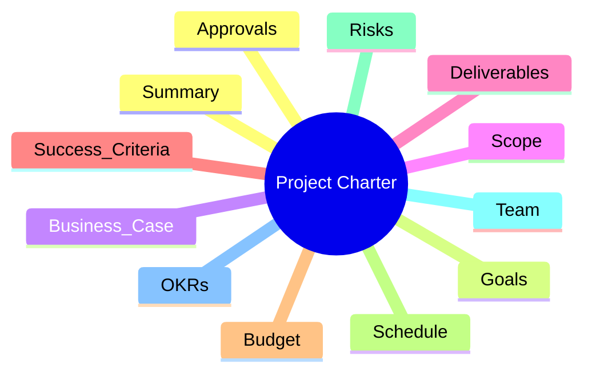
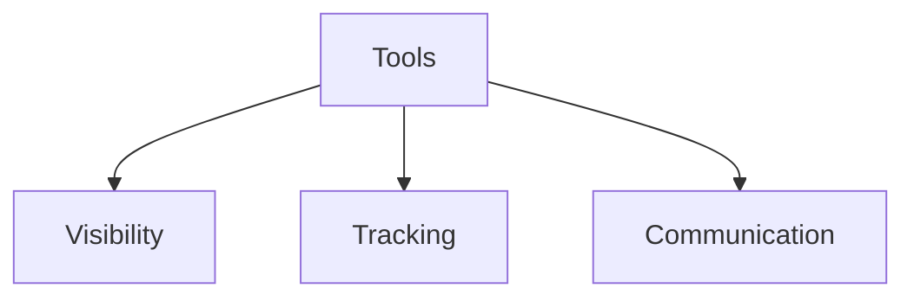
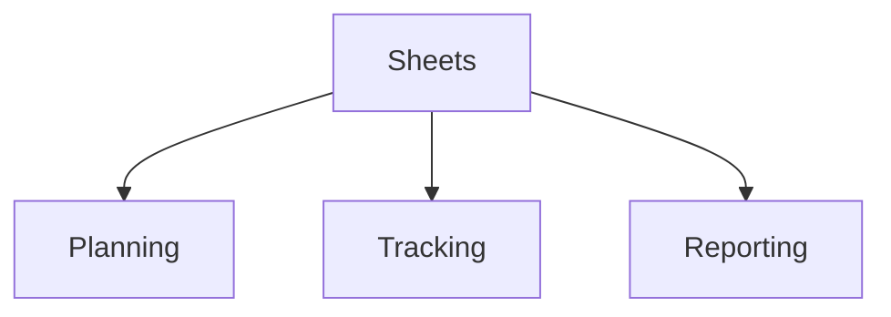
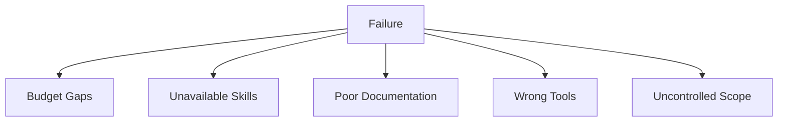

# Project Initiation — Resources, Documentation, and Tools
## Instructor-Level Summary with Visual Models

---

## 1. Resource Management in Project Initiation — *What Makes Work Possible*

> 🧩 **Project resources are everything you depend on to get work done.**

Project resources include:
- **Budget** (money)
- **People** (skills and time)
- **Materials** (physical or digital)

> 🧠 **Instructor Insight:**  
> Resources are interconnected.  
> No budget → no materials.  
> No materials → people can’t work.  

Early resource planning prevents:

- Understaffing

- Budget overruns

- Last-minute surprises

## 2. Budgeting for Projects — Planning the Money

💰 A project budget estimates the total cost required to complete the project.

Common Budget Categories

Team costs: salaries, hours, contractors

Services: vendors, consultants

Materials: tools, software, equipment

📌 Instructor Rule:
If you overspend in one category, you affect all others.

Why Budgeting Starts in Initiation

Reveals hidden costs

Aligns scope with reality

Sets stakeholder expectations early

## 3. People — Your Most Critical Resource

👥 Projects succeed or fail based on people.

What PMs Must Confirm

Skill alignment with tasks

Time commitment and availability

Buy-in and motivation

🧠 Instructor Insight:
The best partners are people aligned with the project’s goals — not just assigned to it.

## 4. Materials — Physical and Digital

🧱 Materials are anything required to complete the work.

Examples:

Physical: equipment, supplies

Digital: software licenses, cloud storage

Intangible: training, documentation

📌 Instructor Rule:
If it costs money or time, include it in your materials plan.

## 5. Documentation — How Projects Remember Decisions

📝 Documentation captures what was decided and why.

Why Documentation Matters

Communicates goals, scope, and resources

Preserves early decisions

Helps onboard new team members

Reduces rework and confusion

## 6. Types of Documentation
Formal Documentation

Emails

Presentations

Digital documents

Shared folders or tools

Value of Documentation

Reveals missing tasks or costs

Serves as a historical record

Supports future projects

🧠 Instructor Insight:
If it isn’t documented, it didn’t happen.

## 7. Project Proposal vs. Project Charter

Project Proposal

Created first

Persuades stakeholders

Explains why the project should exist

Project Charter

Created after approval

Defines what the project is

Used throughout the lifecycle

📌 Key Difference:
Proposal = ask for permission
Charter = permission granted

## 8. Project Charter — The Project Compass

🧭 The project charter guides every major decision.

Why the Charter Matters

Aligns strategy, scope, and value

Grants authority to the PM

Serves as a single source of truth

🧠 Instructor Insight:
A strong charter prevents weak execution.

## 9. Key Components of a Project Charter

Typical Charter Elements

Project name & summary

SMART goals

Business case (benefits vs. costs)

Scope (in & out)

Budget and timeline

Risks and assumptions

Stakeholders and approvals

📌 Instructor Rule:
Include enough detail to guide — not overwhelm.

## 10. Tools in Project Management — Making Work Visible

🛠️ Tools help you plan, track, and communicate.

Why Tools Matter

Increase transparency

Improve coordination

Track progress and resources

Reduce manual effort

## 11. Choosing the Right Tool

🎯 The best tool fits the project — not the other way around.

Selection Considerations

Project size and complexity

Team familiarity

Stakeholder needs

🧠 Instructor Insight:
Simple tools often outperform complex tools on small projects.

## 12. Introducing New Tools Successfully
Best Practices

Communicate early

Ask for stakeholder feedback

Run demos or trials

Ensure accessibility

Provide training

Plan transition periods

📌 Pro Tip:
Adoption fails more often than tools do.

## 13. Common Project Management Tools
### Work Management Platforms

Asana

Trello

Monday.com

Basecamp

ClickUp

Jira

Spreadsheets

Google Sheets

Excel

🧠 Instructor Insight:
Learn one tool deeply — others will feel familiar.

## 14. Using Spreadsheets Effectively
### Core Capabilities

- Collaboration (edit, comment, view)

- Lists and structured data

- Sorting and filtering

- Conditional formatting

- Charts and graphs

- Calculations and formulas

## 15. Templates — Work Smarter, Not Harder

Common templates:

- Project timelines

- Budget trackers

- Gantt charts

- Event marketing plans

📌 Instructor Rule:
Templates save time and reduce errors.

## 16. Why Projects Fail — Resource & Initiation Issues

### Preventable Causes

- Unclear expectations

- Unrealistic budgets or timelines

- Miscommunication

- Resource shortages

- Scope creep

🧠 Instructor Insight:
Most failures are preventable — and start in initiation.
