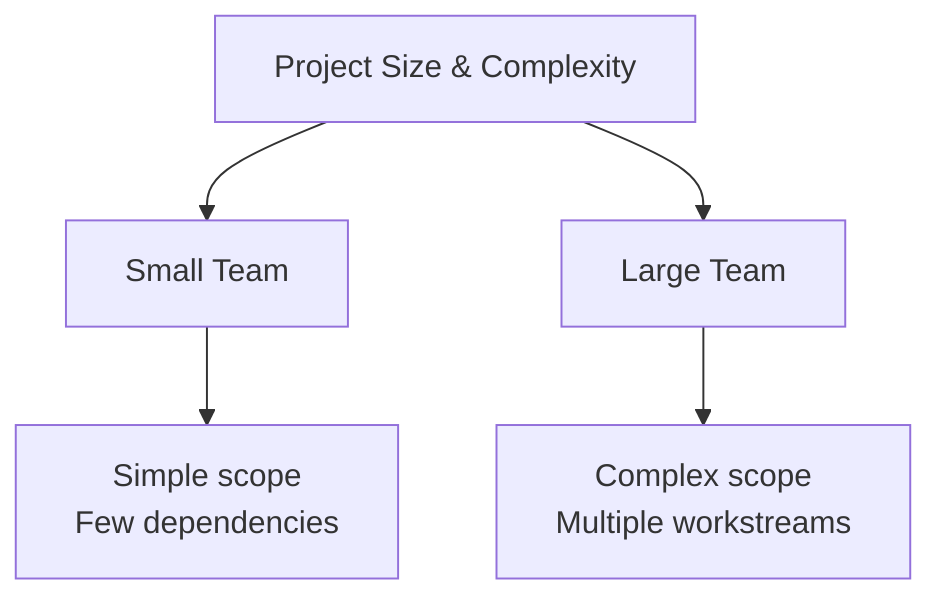
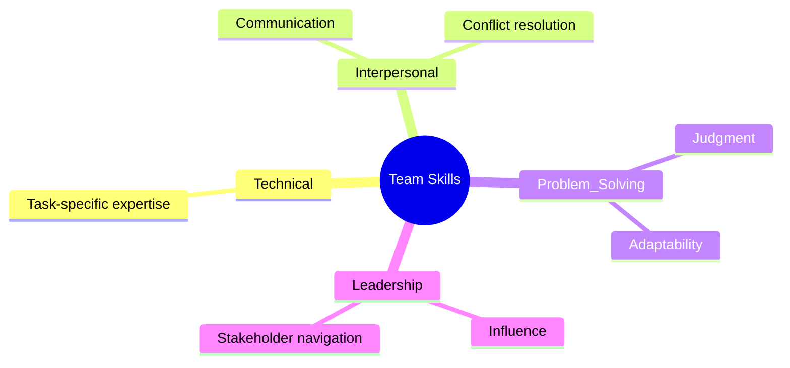
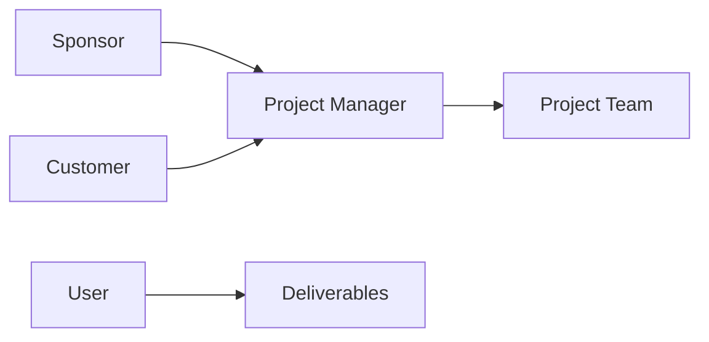
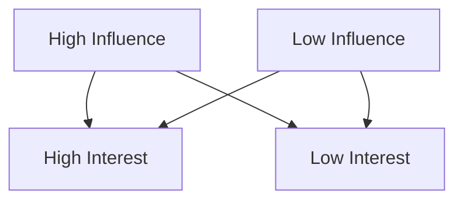
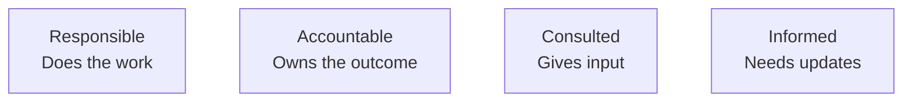
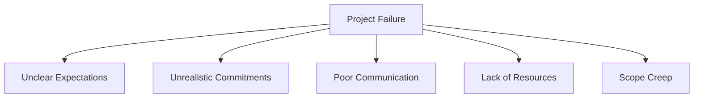

# Project Initiation — Teams, Accessibility, Stakeholders, and Roles
## Instructor-Level Summary with Visual Models

---

## 1. Accessibility — Designing for Everyone

> ♿ **Accessibility is not a feature — it is a responsibility.**

Accessibility means **removing barriers** that prevent people with disabilities from accessing technology, information, and collaboration.  
It must be considered across **all roles**:
- Product designers
- Developers
- Project managers
- Team members

### Why Accessibility Matters
- Over **1 billion people globally** live with a disability
- Disabilities can be:
  - **Permanent** (e.g., vision impairment)
  - **Temporary** (e.g., injury)
  - **Situational** (e.g., noisy environment, low bandwidth)

> 🧠 **Instructor Insight:**  
> Accessibility improves outcomes for *everyone*, not just people with disabilities.

---

## 2. Collaboration & Project Management

> 🤝 **Good collaboration requires inclusive systems.**

Project managers must ensure:
- Teams can work effectively together
- Tools, processes, and communication support diverse needs
- No one is unintentionally excluded

### Accessibility Benefits
- Better team performance
- Higher-quality deliverables
- Reduced friction and rework

---

## 3. Building the Project Team — Getting the Size Right


🧱 Instructor Rule:
Too small → overload
Too large → communication breakdown
The PM finds the balance.

## 4. Choosing Roles — Skills That Matter
Types of Skills Every Team Needs


Technical skills: Do the work

Interpersonal skills: Work with others

Problem-solving skills: Handle uncertainty

Leadership skills: Build buy-in and direction

🧠 Instructor Insight:
Technical skills start the project.
Interpersonal and leadership skills finish it.

## 5. Availability, Motivation, and Diversity
### Availability

- Matrix organizations = shared resources

- Pre-assigned team members are common

- PMs don’t always get to choose their team

### Motivation

- Volunteers often show higher engagement

- Pre-assigned does not mean disengaged

- PMs must actively motivate the team

### Diversity & Trust

Diversity improves creativity and outcomes

Trust enables honest feedback and debate

Psychological safety is built early

🎯 Instructor Rule:
Diversity is an asset only when trust exists.

## 6. Project Roles — Who Does What?


### Key Roles

Project Sponsor: Accountable for value and funding

Project Manager: Manages people, information, and time

Team Members: Execute the work

Customers: Define requirements and pay

Users: Use the final product

📌 Key Distinction:
Customers ≠ Users (sometimes the same, often not)

## 7. Understanding Stakeholders

🎯 Stakeholders are anyone invested in the project’s outcome.

### Stakeholder Types

Primary stakeholders: Directly affected

Secondary stakeholders: Indirectly affected

Examples:

Sponsor, team members, customers → Primary

Legal, finance support, operations → Secondary

## 8. Stakeholder Analysis — Power vs. Interest


### The Power Grid (4 Quadrants)

```mermaid
graph LR
    Q1[Manage Closely(High Influence / High Interest)]
    Q2[Meet Their Needs(High Influence / Low Interest)]
    Q3[Show Consideration(Low Influence / High Interest)]
    Q4[Monitor(Low Influence / Low Interest)]
```

Quadrant	Strategy
High / High	Partner closely
High / Low	Keep satisfied
Low / High	Keep informed
Low / Low	Monitor

🧠 Instructor Insight:
Stakeholder management is about prioritization, not equality.

## 9. Generating Stakeholder Buy-In
### Buy-In Best Practices

- Map project work to stakeholder goals

- Show department-level benefits

- Listen and adapt (without overpromising)

- Set realistic expectations early

### Powerful Questions to Ask

- What does success look like for you?

- How does this project support your priorities?

- What concerns do you have?

- Who else should I talk to?

## 10. RACI Chart — Clarifying Ownership


### Why RACI Works

Eliminates confusion

Clarifies decision authority

Improves communication

Prevents overload and silos

📌 Golden Rule:
Every task has one and only one Accountable.

## 11. Using RACI Effectively
### Best Practices

- Use roles, not names

- Balance workload (count the Rs)

- Avoid too many Cs (decision paralysis)

- Plan efficient updates for Is

### When to Use RACI

- Large teams

- Many stakeholders

- Complex or cross-functional projects

## 12. Why Projects Fail — Initiation Mistakes

### Common Causes

- Undefined goals and deliverables

- Unrealistic timelines

- Weak communication systems

- Insufficient skills or budget

- Uncontrolled scope changes


